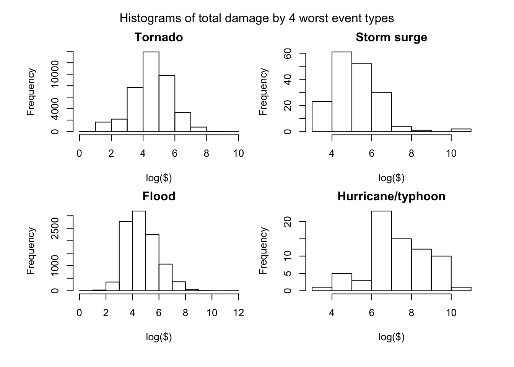
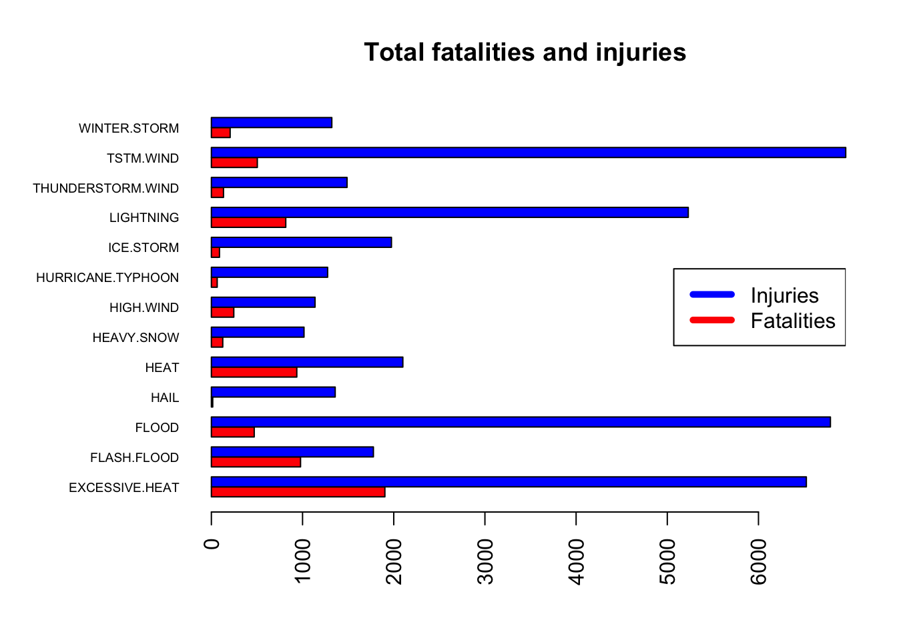
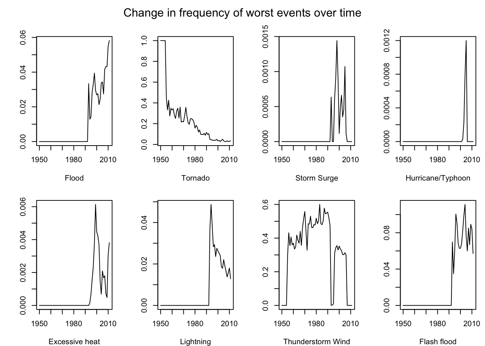

# Tornados Hurt And Floods Are Expensive
Luke Wolcott  

## Synopsis

We analyze 62 years of NOAA data on severe weather events to determine the most harmful and expensive.  The data set of over 900,000 events records, among other things, the type of event, the property damage and crop damage caused, and any fatalities and injuries.  Looking first at property and crop damage, we find that floods are the worst, followed by hurricanes, tornados, and storm surges.  Tornados cause the most fatalities and injuries by far, but after tornados the most dangerous are excessive heat, floods, thunderstorm wind, and lightning.

## Data Processing

In this section we describe how we load and preprocess the data.  The original NOAA Storm Data file was downloaded on 7/25/2016 from the following address.

https://d396qusza40orc.cloudfront.net/repdata%2Fdata%2FStormData.csv.bz2

Assuming this .bz2 file is in the working directory, we load the data as follows.


```r
d <- read.csv("repdata%2Fdata%2FStormData.csv.bz2", header = TRUE, stringsAsFactors = FALSE)
```

To begin to clean this data frame, we subset for the columns that we are interested in, and create a new column YEARS that records the year of each event.


```r
e <- d[,c(1,2,7,8,23,24,25,26,27,28)]
YEARS <- strptime(e[,2], "%m/%d/%Y %H:%M:%S")$year+1900
e <- cbind(e, YEARS)
e$STATE__ <- NULL
e$BGN_DATE <- NULL
```

The information about property damage is in two columns: one records a number and the other records an exponent.  The codebook clarifies that the exponent should be K, M, or B, to indicate thousands, millions, or billions of dollars.  However, some of the exponent entries are not of this form.  We remove these flawed entries (which comprise only about 0.04% of the data), and then create a new column PD that converts the two columns into a single numeric column that is easier to work with.  

Likewise, we do the same for crop damage and make a column CD.  We also create a column TD that is the sum of PD and CD.


```r
okay <- c("", "K", "B", "M")
e <- subset(e, e$PROPDMGEXP %in% okay)
e <- subset(e, e$CROPDMGEXP %in% okay)
 
PD <- rep(1, nrow(e))
for (i in 1:nrow(e))
{
      if (e$PROPDMGEXP[i] == "")
            PD[i] <- e$PROPDMG[i]
      else if (e$PROPDMGEXP[i] == "B")
            PD[i] <- e$PROPDMG[i]*1000000000
      else if (e$PROPDMGEXP[i] == "K")
            PD[i] <- e$PROPDMG[i]*1000
      else
            PD[i] <- e$PROPDMG[i]*1000000
}
e <- cbind(e, PD)

CD <- rep(1, nrow(e))
for (i in 1:nrow(e))
{
      if (e$CROPDMGEXP[i] == "")
            CD[i] <- e$CROPDMG[i]
      else if (e$CROPDMGEXP[i] == "B")
            CD[i] <- e$CROPDMG[i]*1000000000
      else if (e$CROPDMGEXP[i] == "K")
            CD[i] <- e$CROPDMG[i]*1000
      else
            CD[i] <- e$CROPDMG[i]*1000000
}
e <- cbind(e, CD)
TD <- PD + CD
e <- cbind(e, TD)
```

At this point, we have a data frame called e, with 901,921 rows and 12 columns.  The most useful columns to us are: EVTYPE, which gives the type of weather event; YEARS, giving the year; PD, giving the property damage from the event; CD, giving the crop damage; and FATALITIES and INJURIES.

## Results

### Which events cause the most property and crop damage?

The following code splits the data frame by event type EVTYPE and adds up the PD, CD, and TD columns.  This allows us to investigate the total property and crop damage done over 62 years by each type of event.


```r
# first for property damage
a <- as.data.frame(lapply(split(e$PD, e$EVTYPE), sum))
tPD <- t(rbind(names(a), a))
row.names(tPD) <- NULL
tPD <- as.data.frame(tPD, stringsAsFactors = FALSE)
names(tPD) <- c("EVTYPE", "Total_PD")
tPD$EVTYPE <- as.character(tPD$EVTYPE)
tPD$Total_PD <- as.numeric(tPD$Total_PD)

# second for crop damage
b <- as.data.frame(lapply(split(e$CD, e$EVTYPE), sum))
tCD <- t(rbind(names(b), b))
row.names(tCD) <- NULL
tCD <- as.data.frame(tCD, stringsAsFactors = FALSE)
names(tCD) <- c("EVTYPE", "Total_CD")
tCD$EVTYPE <- as.character(tCD$EVTYPE)
tCD$Total_CD <- as.numeric(tCD$Total_CD)
tC <- merge(tPD, tCD)
      
# and the total damage
Total_D <- tC$Total_PD + tC$Total_CD
tC <- cbind(tC, Total_D)
```

There are 981 different event types.  We can subset for event types that have done total damage over $10 billion; there are nine.  These could be presented as a nice barplot, but we leave that to the reader since our figures are limited.


```r
subset(tC, tC$Total_D > 1e10)
```

```
##                EVTYPE     Total_PD    Total_CD      Total_D
## 85            DROUGHT   1046106000 13972566000  15018672000
## 143       FLASH.FLOOD  16140811717  1420727100  17561538817
## 159             FLOOD 144657709807  5661968450 150319678257
## 232              HAIL  15727165777  3000537453  18727703230
## 389         HURRICANE  11868319010  2741910000  14610229010
## 398 HURRICANE.TYPHOON  69305840000  2607872800  71913712800
## 577       RIVER.FLOOD   5118945500  5029459000  10148404500
## 657       STORM.SURGE  43323536000        5000  43323541000
## 821           TORNADO  56925485483   364950110  57290435593
```

Some of these event types are damaging to both property and crops.  On the other hand, storm surges do property damage but little crop damage, and, for example, droughts damage crops much more than property.  Subsetting according to Total_PD or Total_CD, however, does not bring any new event types to the fore.  Our conclusion is that this list of nine event types are the most damaging.

Before we consider fatalities and injuries, we look further into the four most physically damaging events: tornados, floods, storm surges, and hurricane/typhoons.  These have caused the most total damages, but how frequently do they occur, and how costly is each single event?  

The plot below shows four histograms, of the total damages done by each of these four most egregious types.  Note that we use a log scale for the dollar amount of damages.


```r
par(mfcol=c(2,2), mar=c(4,4,2,1), oma=c(2,2,2,2))
a <- subset(e, e$EVTYPE == "TORNADO" & e$TD != 0)
hist(log10(a$TD), breaks=8, main="Tornado", xlab="log($)")
a <- subset(e, e$EVTYPE == "FLOOD" & e$TD != 0)
hist(log10(a$TD), breaks=8, main="Flood", xlab="log($)")
a <- subset(e, e$EVTYPE == "STORM SURGE" & e$TD != 0)
hist(log10(a$TD), breaks=8, main="Storm surge", xlab="log($)")
a <- subset(e, e$EVTYPE == "HURRICANE/TYPHOON" & e$TD != 0)
hist(log10(a$TD), breaks=8, main="Hurricane/typhoon", xlab="log($)")
mtext("Histograms of total damage by 4 worst event types", outer=TRUE)
```

 

These plots show many interesting characteristics.  There are a lot of tornados, but each one does relatively less damage.  Floods occur less frequently but are about an order of magnitude more damaging.  Hurricanes are much less frequent, but do more damage.  Furthermore, there aren't very many "cheap" hurricanes; they almost always cause at least a million dollars of damage.

Finally, while most storm surges cause less than $10 million in damage, there are a few interesting outliers.  We can investigate further by subsetting for these expensive storm surges.


```r
a <- subset(e, e$EVTYPE == "STORM SURGE" & e$TD != 0)
subset(a, a$TD > 1e8)
```

```
##        STATE      EVTYPE FATALITIES INJURIES PROPDMG PROPDMGEXP CROPDMG
## 577676    LA STORM SURGE          0        0   31.30          B       0
## 577681    LA STORM SURGE          0        0  432.00          M       0
## 581535    MS STORM SURGE          0        0   11.26          B       0
##        CROPDMGEXP YEARS        PD CD        TD
## 577676             2005 3.130e+10  0 3.130e+10
## 577681             2005 4.320e+08  0 4.320e+08
## 581535             2005 1.126e+10  0 1.126e+10
```

These three incredibly expensive storm surges were reported in 2005 in Louisianna and Mississippi.  Most likely these correspond to the devastating effects of Hurricane Katrina.

### Which events cause the most fatalities and injuries?

Similar to our approach with physical damage, we split the data frame e according to event type and add up the fatalities and injuries caused by each type over the 62 years of reporting.


```r
# first for fatalities
a <- as.data.frame(lapply(split(e$FATALITIES, e$EVTYPE), sum))
tF <- t(rbind(names(a), a))
row.names(tF) <- NULL
tF <- as.data.frame(tF, stringsAsFactors = FALSE)
names(tF) <- c("EVTYPE", "Total_F")
tF$EVTYPE <- as.character(tF$EVTYPE)
tF$Total_F <- as.numeric(tF$Total_F)
      
# second for injuries
b <- as.data.frame(lapply(split(e$INJURIES, e$EVTYPE), sum))
tI <- t(rbind(names(b), b))
row.names(tI) <- NULL
tI <- as.data.frame(tI, stringsAsFactors = FALSE)
names(tI) <- c("EVTYPE", "Total_I")
tI$EVTYPE <- as.character(tI$EVTYPE)
tI$Total_I <- as.numeric(tI$Total_I)
tPL <- merge(tF, tI)
```

This creates a data frame tPL that has one row for each EVTYPE, with columns Total_F and Total_I for total fatalities and injuries.  

The events with over 1000 fatalities:


```r
subset(tPL, tPL$Total_F > 1e3)
```

```
##             EVTYPE Total_F Total_I
## 120 EXCESSIVE.HEAT    1903    6525
## 821        TORNADO    5630   91285
```

The events with over 1000 injuries:


```r
subset(tPL, tPL$Total_I > 1e3)
```

```
##                EVTYPE Total_F Total_I
## 120    EXCESSIVE.HEAT    1903    6525
## 143       FLASH.FLOOD     978    1777
## 159             FLOOD     470    6789
## 232              HAIL      15    1358
## 263              HEAT     937    2100
## 298        HEAVY.SNOW     125    1016
## 347         HIGH.WIND     246    1137
## 398 HURRICANE.TYPHOON      64    1275
## 416         ICE.STORM      89    1975
## 451         LIGHTNING     816    5230
## 747 THUNDERSTORM.WIND     133    1488
## 821           TORNADO    5630   91285
## 843         TSTM.WIND     504    6957
## 959      WINTER.STORM     206    1321
```

One of the first things we find is that tornados are the most harmful by far.  After tornados, the most harmful event types are: excessive heat, flood, thunderstorm wind, and lightning.

The following barplot shows the most harmful event types.  Note that we have omitted tornados from the fatalities/injuries barplot, since it is so significantly more harmful (5630 fatalities and 91,285 injuries).


```r
Total_PL <- tPL$Total_F + tPL$Total_I
tPL <- cbind(tPL, Total_PL)
worst2 <- subset(tPL, tPL$Total_PL > 1e3 & tPL$EVTYPE != "TORNADO")

par(las=2, mar=c(5,8,4,2))
barplot(t(worst2[,2:3]), names.arg = worst2$EVTYPE, horiz = TRUE, cex.names = 0.6, main="Total fatalities and injuries", col = c("red", "blue"), beside=TRUE)
legend("right", lty=c(1,1), lwd=c(5,5), col=c("blue", "red"), legend=c( "Injuries", "Fatalities"))
```

 

### Are things getting worse?

Now that we've identified some of the worst types of events, we would like to investigate whether these events are becoming more frequent.  For example, consider floods.  What percentage of of the severe weather events reported in our 1950 data were floods?  What percentage in 1951 were floods?  What percentage in 2011 were floods?  The following code calculates these percentages for each year, for each of eight of the worst event types.  The plots are not very convincing, however.


```r
      names <- c("FLOOD", "TORNADO", "STORM SURGE", "HURRICANE/TYPHOON", "EXCESSIVE HEAT", "LIGHTNING", "TSTM WIND", "FLASH FLOOD")
      YEARS <- 1950:2011
      PERCENTS <- matrix(rep(0, 62*8), nrow=62)
      for (i in 1:62)
      {
            a <- subset(e, e$YEARS == 1949+i)
            for (j in 1:8)
            {
                  PERCENTS[i,j] <- sum(a$EVTYPE==names[j])/nrow(a)
            }
      }
      timeC <- cbind(YEARS, PERCENTS)
      timeC <- as.data.frame(timeC)
      names(timeC) <- c("YEARS", names)
      x <- timeC      
      par(mfrow = c(2,4), mar=c(4,4,2,1), oma=c(0,0,2,0))
      plot(x$YEARS, x$FLOOD, type='l', ylab="", xlab="Flood")
      plot(x$YEARS, x$TORNADO, type='l', ylab="", xlab="Tornado")
      plot(x$YEARS, x$'STORM SURGE', type='l', ylab="", xlab="Storm Surge")
      plot(x$YEARS, x$'HURRICANE/TYPHOON', type='l', ylab="", xlab="Hurricane/Typhoon")
      plot(x$YEARS, x$'EXCESSIVE HEAT', type='l', ylab="", xlab="Excessive heat")
      plot(x$YEARS, x$LIGHTNING, type='l', ylab="", xlab="Lightning")
      plot(x$YEARS, x$'TSTM WIND', type='l', ylab="", xlab="Thunderstorm Wind")
      plot(x$YEARS, x$'FLASH FLOOD', type='l', ylab="", xlab="Flash flood")
      mtext("Change in frequency of worst events over time", outer=TRUE)
```

 

There is a good chance that something is wrong with this last analysis and plot.  In the name of reproducible research, we leave it to the reader to take the next steps.


